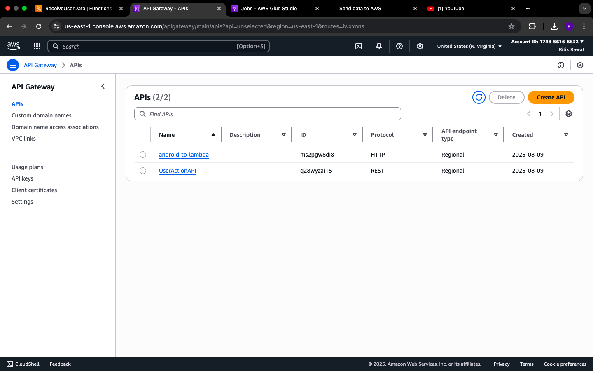
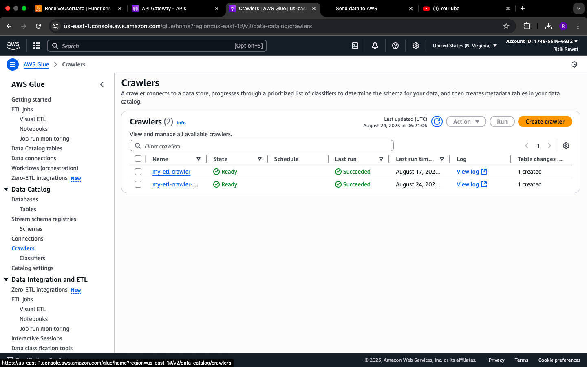

# Transaction Data Pipeline with Android + AWS

## 📌 Project Overview
This project integrates an **Android application** with an **AWS-based ETL data pipeline** to collect, process, and analyze transaction data.  

On the Android side, users perform financial transactions (e.g., payments, purchases). The app captures key transaction details such as:

- `user_id`
- `timestamp`
- `amount`
- `merchant_name`
- `payment_method`
- `category`
- additional metadata  

These events are securely sent to **AWS S3 (Bronze layer)** for storage.

On the AWS side, an **ETL pipeline built using AWS Glue** processes the data through multiple stages:

- **Bronze Layer (Raw Data):** Stores unprocessed transaction data received from the Android app.  
- **Silver Layer (Cleaned Data):** AWS Glue jobs clean, validate, and standardize the raw data (e.g., handling missing values, converting amounts, ensuring schema consistency).  
- **Gold Layer (Transformed Data):** Aggregates and transforms data into analytics-ready datasets (e.g., spending patterns, category-based reports).  

The cleaned and transformed data is made queryable via **Amazon Athena**, enabling flexible SQL-based analysis. To automate workflows, **AWS Glue Triggers** schedule ETL jobs daily (or at custom intervals).  

This ensures a seamless data flow:  

📱 **Android App (Data Source)** → 🪣 **S3 (Bronze)** → 🧹 **Glue (ETL: Silver/Gold)** → 📊 **Athena (Analytics & Reporting)**  

---

## 🚀 Technologies Used
- **Android (Kotlin, Jetpack Compose)** – for capturing and sending transaction data  
- **AWS S3** – raw data storage (Bronze layer)  
- **AWS Glue** – ETL processing (cleaning, validation, transformation)  
- **AWS Glue Triggers** – workflow automation  
- **Amazon Athena** – SQL-based querying and analysis  
- **Python / PySpark (in Glue Jobs)** – data cleaning & transformation  

---

## 🔑 Prerequisites
Before running this project, ensure you have:  
- AWS account with access to **S3, Glue, Athena**  
- IAM roles and permissions for ETL operations  
- Android Studio setup with an emulator or physical device  
- Basic knowledge of **ETL pipelines** and **SQL queries**  
- Proper networking setup for secure communication between Android and AWS  

---

## 📸 Screenshots

  
  
  
  
  
  
  
  
  

